# Meu Aroma E-Commerce Platform

## Introduction
"Meu Aroma" is an advanced e-commerce platform designed to provide a seamless and intuitive shopping experience for a wide range of products. Our goal is to create a user-friendly platform where customers can easily browse, select, and purchase products that meet their needs. This project leverages modern web technologies to ensure a secure, efficient, and enjoyable shopping process from product selection to checkout and secure payment. 
Meu Aroma is a real and very small family business so I decided to take this chance to create this mock web page for selling the products. Meu Aroma approaches to making our products is all about being kind to the environment. We craft our real, handmade soaps with the best practices in mind, using ingredients that are good for you and the planet. Our products are made with natural essential oils and plant-based materials, ensuring everything we offer is vegan and environmentally friendly.

Choosing Meu Aroma means choosing a product that cares for your body, mind, and our earth. It's not just about buying something nice for yourself; it's about joining a community that values living in a better, more sustainable way.

<br> 

If you want to check the lastest version of Meu Aroma

## [Click here](https://meuaroma-7872e870b93d.herokuapp.com/)

<br>    

# User Experience

<details>
<summary>User Stories and Goals</summary>

The evolution of "Meu Aroma" is a narrative shaped by specific user stories, meticulously capturing the essence of both the shopper's journey and the store owner's operational needs. These stories, following the agile methodology, stand as the pillars of our development process, ensuring that every feature, every interaction, and every enhancement aligns perfectly with the real-world requirements of our users. Here's a glimpse into the key user stories that have been the driving force behind the platform:

- **View Variety of Products**: Empowers users to explore a diverse selection of products, enriching the shopping experience with variety and choice.
- **Detailed Product Information**: Offers comprehensive details on each product, including price, description, ratings, and available sizes, enabling informed purchasing decisions.
- **Deals and Special Offers**: Highlights promotions prominently, providing an opportunity for users to capitalize on savings and special offers.
- **Monitor Purchase Total**: Equips the platform with tools to effortlessly track the total cost of purchases, aiding in effective budget management.
- **Effortless Account Management**: Simplifies account registration, login, and management processes, complemented by features for password recovery and account confirmation.
- **Secure Checkout Process**: Ensures the security of personal and payment information, fortifying user trust and maintaining the integrity of the platform.
- **Order Confirmation and Order by email**: Provides immediate feedback and order confirmation post-purchase, with essential details dispatched via email for record-keeping.
- **Inventory Management**: Enables store owners to meticulously manage product listings, with functionalities to add, edit, or remove items, and harness the coupon system effectively.
- **Smart Savings with Coupon System**: Introduces an intuitive coupon system, crafted to augment the shopping experience with meaningful savings. Tailored coupons, like `FIRSTBUY20`, await to delight both first-time buyers and regular shoppers alike.
- **Apply for Partnership**: Easy proccess for partners application to become a regular seller of Meu Aroma products. 


</details>

<br>

<details>
<summary>User Experience and Features</summary>

"Meu Aroma" is dedicated to providing an exceptional user experience tailored to meet the specific needs of our customers. We've designed a platform that not only looks great but is also functional and user-friendly.

- **Streamlined Profile Creation and Management**: Setting up and managing your profile. With just a few clicks, you can create a profile, save your personal information, and manage your address. Our straightforward process for registration, password changes, and recovery ensures that you're always in control of your account.

- **Branded Aesthetic**: Our website radiates the warmth and vitality of our brand with a color palette that includes yellow, olive green, orange, and red, complemented by standard Bootstrap colors for notifications, ensuring a visually appealing and intuitive user experience.

- **Simplified Shopping Bag and Checkout**: Our shopping bag and checkout process are designed for your convenience. Add products to your bag and proceed to checkout in just a few steps, with a clear and secure process for entering card details.

- **Diverse Product Selection and Advanced Sorting**: Dive into our wide range of products, neatly organized into categories. Our advanced search bar and sorting features allow you to easily find products by name or price, ensuring you find exactly what you're looking for.

- **Exclusive Coupon System**: Enjoy special discounts with our coupon system, especially designed for first-time buyers. Apply your coupon at checkout and watch the price drop, making your first purchase even more delightful.

- **Automated Delivery with Free Shipping Threshold**: Our delivery system automatically calculates your shipping cost, and we offer free delivery for orders over 60 euros, adding more value to your shopping experience.

- **Informative FAQ and Newsletter Page**: Stay in the loop with our FAQ and newsletter pages. Whether you're a returning buyer or a first-time visitor, you'll find all the information you need about our products, services, and special offers.

- **Real-Time Inventory Management**: Our real-time inventory management ensures that the products displayed are available and up-to-date, providing you with accurate information and a smooth shopping experience.

- **Personalized Product Recommendations**: Based on your browsing history and preferences, we offer personalized product recommendations, making it easier for you to discover new items and revisit your favorites. (to be implemented)

</details>

<br>

<details>

<br>

<summary>Agile Methodology in Meu Aroma</summary>

In "Meu Aroma", agile methodologies have been central to our approach in managing and advancing the project effectively. Utilizing GitHub Project Boards, I have meticulously organized and prioritized tasks to streamline in the development process. Here's an insight into our agile journey:

1. **Epic Categorization:** I kickstarted the project by identifying key themes that are pivotal to my platform. These encompass essential features like Product Catalog, User Account Management, Shopping Experience, Payment Integration, and Inventory Management. This strategic categorization allowed me to outline epics, shaping a clear developmental pathway.

2. **User Story Mapping:** With a focus on delivering value to the users, I crafted detailed user stories. To streamline this process, I introduced a standardized issue template on GitHub, ensuring that each user story is comprehensive and actionable.

3. **Structured Task Management:** In the GitHub repository, I configured settings to facilitate task management effectively. My Issue Template has been a cornerstone, guiding developers with the necessary details to focus on delivering the Minimum Viable Product (MVP), keeping our development lean and purpose-driven.

4. **Rigorous Development Workflow:** The development of "Meu Aroma" I realized through Python and Django, reflecting my commitment to robust and scalable solutions. The deployment phase was meticulously handled, setting Debug = `False` creating also a 404 error page, to ensure a seamless and secure transition from development to a live environment.

<br>

</details>

<br>

<details>
<summary>User Stories</summary>

<br>

The journey of "Meu Aroma" is meticulously mapped out through a series of user stories that encapsulate the aspirations and needs of its diverse user base. These stories guide the platform's evolution, ensuring a user-centric approach that resonates with shoppers and store owners alike:

- 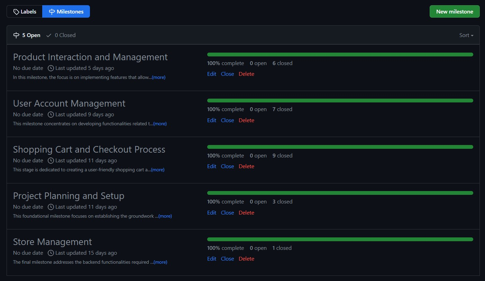
- 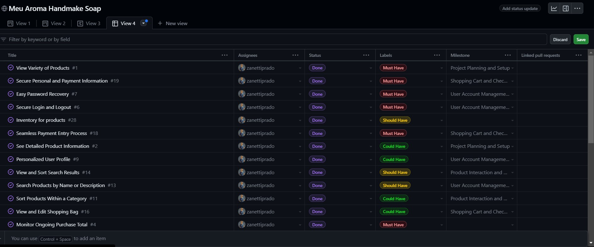

<br>

1. Project Planning and Setup

    - USER STORY: **View Variety of Products**: As a shopper, I want to view a variety of products so I can select items for purchase. Goal: Select items for purchase

    - USER STORY: **See Detailed Product Information**:  As a shopper, I want to see detailed information about each product, including its price, description, rating, image, and sizes available. Goal: Make informed purchasing decisions

    - USER STORY: **Spot Deals and Special Offers**:  As a shopper, I aim to quickly spot deals, discounted items, and special offers to make cost-effective purchases. Goal: Take advantage of special offers and savings

2. User Account Management

    - USER STORY: **Search Products by Name or Description**:  As a shopper, I wish to search for products by name or description to determine if they meet my purchasing needs. Goal: Find products meeting specific criteria

    - USER STORY: **Personalized User Profile**:  As a site user, I desire a personalized profile to review my order history, confirmations, and save my payment details. Goal: Personalize and manage my shopping experience

    - USER STORY: **Effortless Account Registration**:  As a site user, I want to register for an account effortlessly to manage my personal profile and view my activity. Goal: Manage personal profile and activity

    - USER STORY:  **Secure Login and Logout**:  As a site user, I need a straightforward way to log in and out of my account to access my personal information securely. Goal: Securely access personal account information

    - USER STORY:  **Email Confirmation After Registration**:  As a site user, I expect to receive an email confirmation after registering to confirm the successful creation of my account. Goal: Verify account registration

    - USER STORY:  **Easy Password Recovery**:  As a site user, I want an easy method to recover my password, ensuring I can regain access to my account if forgotten. Goal: Recover access to account

    - USER STORY:  **Register as a Business Partner**: As a user interested in becoming a business partner, I want to easily register my interest through a simple form, So that I can apply to become a partner and start selling products.

3. Shopping Cart and Checkout Process

    - USER STORY:  **Receive Email Confirmation Post-Purchase**:  As a shopper, I expect to receive an email confirmation post-purchase to keep a record of my transactions. Goal: Keep a record of transactions

    - USER STORY:  **Secure Personal and Payment Information**:  As a shopper, I want assurance that my personal and payment information is secure to confidently make transactions. Goal: Secure personal and payment information

    - USER STORY:  **Add New Products to Store**:  As the store owner, I want to add new products to expand my store's offerings. Goal: Expand store offerings

    - USER STORY:  **Edit or Update Product Details**:  As the store owner, I need to edit or update product details to ensure accurate and current product information. Goal: Maintain accurate product information

    - USER STORY:  **Seamless Payment Entry Process**:  As a shopper, I need a seamless process to enter my payment information, ensuring a hassle-free checkout experience. Goal: Streamline the checkout process.

    - USER STORY:  **See Order Confirmation After Checkout**:  As a shopper, I wish to see an order confirmation after checkout to confirm the accuracy of my order. Goal: Confirm order details

    - USER STORY:  **Modify bag Quantity**: As a shopper, I want to easily modify the quantity of items in my cart to adjust my purchase as needed. Goal: Adjust purchase quantities

    - USER STORY: **Monitor Ongoing Purchase Total**:  As a shopper, I want to easily monitor the total cost of my ongoing purchases to manage my budget effectively. Goal: Manage budget and avoid overspending

    - USER STORY:  **View and Edit Shopping Bag**:  As a shopper, I need to view and edit items in my shopping bag, ensuring I am aware of the total cost and contents before checkout. Goal: Review and finalize purchases

    - USER STORY:  **Select Product and Quantity Accurately**:  As a shopper, I want to select product and quantity accurately to avoid mistakes in my order. Goal: Ensure accurate product selection

4. Product Interaction and Management

    - USER STORY:  **Sort Through Available Products**:  As a shopper, I want to sort through the list of available products to quickly find items that meet my criteria like price or rating. Goal: Efficiently find desired products

    - USER STORY:  **Sort Multiple Product Categories**:  As a shopper, I want to simultaneously sort multiple product categories to efficiently find the best options across different segments like clothing or home goods. Goal: Compare products across categories

    - USER STORY:  **View and Sort Search Results**:  As a shopper, I need to easily view and sort my search results to quickly decide on potential purchases. Goal: Easily decide on potential purchases

    - USER STORY:  **Sort Products Within a Category**:  As a shopper, I need the ability to sort products within a specific category to find the best-priced or best-rated items easily. Goal: Find the best options in a category

    - USER STORY:  **Receive News from Newsletters**: As a site user, I want to subscribe to newsletters and updates to stay informed about new products and deals. Goal: Stay informed about store updates.

    - USER STORY:  **Coupons for Discounts**: As a shopper, I want to apply discount codes to my purchases so that I can benefit from special offers and save money. Goal: Utilize discounts and save money.

    - USER STORY:  **Question Section for Client Feedback**: As a Buyer I want to check the reviews and feedback from other previous customers to make sure I'm buying a good product

5. Store Management

    - USER STORY:  **Delete Products from Store**:  As the store owner, I want to delete products that are no longer for sale to keep my store's inventory current. Goal: Manage store inventory

    - USER STORY:  **Inventory for Products**: As a shopper, I want to see if products are in stock to make informed decisions about my purchases. Goal: Make informed purchasing decisions based on stock availability.


</details>

<br>


<details>
<summary>Acceptance Criteria</summary>

<br>
Each issue is accompanied by its unique acceptance criteria, along with the tasks associated with it. This structure allows for clear tracking of whether each task has been completed or remains pending.

<br>

- 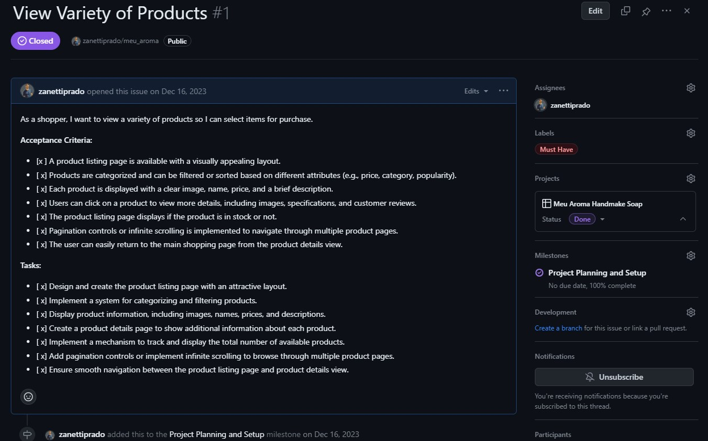
- 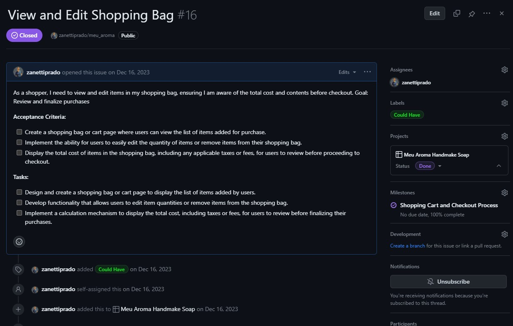

</details>

<br>


<details>
<summary> User Story Prioritization - MoSCoW Method</summary>

<br>

In order to work and decide what task I would implement first and what task I could leave under an "if" categorie I applied the agile MoSCoW methodology.

<br>

- Must-have: Essential requirements that the project must deliver.
- Should-have: Important but not essential; can be postponed if necessary.
- Could-have: Desirable but not necessary; can be delayed or omitted.
- Won't-have this time: Recognized as not being necessary for this delivery but could be considered in the future. (not applied in this project.)

Within the development cycle, user stories are prioritized using the MoSCoW approach as I said. Below is an outline of our current sprint's story allocation:

<br>

| Priority       | User Story                                               | Story Points |
|----------------|----------------------------------------------------------|--------------|
| Must-have      | View Variety of Products                                 |Check         |
| Must-have      | Secure Personal and Payment Information                  |Check         |
| Must-have      | Easy Password Recovery                                   |Check         |
| Must-have      | Secure Login and Logout                                  |Check         |
| Must-have      | Seamless Payment Entry Process                           |Check         |
| Must-have      | Monitor Ongoing Purchase Total                           |Check         |
| Must-have      | Edit or Update Product Details                           |Check         |
| Must-have      | Add New Products to Store                                |Check         |
| Must-have      | Delete Products from Store                               |Check         |
| Should-have    | Inventory for products                                   |Check         |
| Should-have    | View and Sort Search Results                             |Check         |
| Should-have    | Search Products by Name or Description                   |Check         |
| Should-have    |Receive Email Confirmation Post-Purchase                  |Check         |
| Should-have    | Sort Through Available Products                          |Check         |
| Should-have    | Receive news from newsletters                            |Check         |
| Should-have    |  Email Confirmation After Registration                   |Check         |
| Should-have    | Effortless Account Registration                          |Check         |
| Could-have     |See Detailed Product Information                          |Check             |
| Could-have     |Personalized User Profile                                 |Check             |
| Could-have     |Sort Products Within a Category                           |Check             |
| Could-have     |View and Edit Shopping Bag                                |Check             |
| Could-have     | Select Product and Quantity Accurately                   |Check             |
| Could-have     | See Order Confirmation After Checkout                    |Check             |
| Could-have     | Modify bag Quantity                                      |Check             |
| Could-have     | Spot Deals and Special Offers                            |Check             |
| Could-have     |Question section for clients feedback                     |Check             |
| Could-have     |Cupons for discounts                                      |Check             |
| Could-have     |Register as a Business Partner                            |Check             |
| Could-have     | Sort Multiple Product Categories                         |Check             |

<br>


</details>


<br>

# Design
<br>
<details>
<summary>Color Scheme</summary>

**Color Scheme Decision: Bringing Nature to Life**

In designing our project's color scheme, we aimed to create a visually appealing and harmonious experience that aligns with our brand identity and values. Our inspiration for the color scheme draws heavily from the colors featured in our logo, which include vibrant orange, deep red, and fresh green. These colors represent energy, passion, and growth, respectively, and serve as the foundation of our visual identity.

**1. Vibrant Orange:** 
   - **Inspiration:** The color orange, prominently featured in our logo, symbolizes enthusiasm, creativity, and vitality. It represents our commitment to delivering an exciting and engaging user experience.
   - **Application:** We use vibrant orange sparingly to draw attention to important elements, such as call-to-action buttons and highlights. It adds a sense of warmth and energy to our design.

**2. Deep Red:**
   - **Inspiration:** Deep red represents strength, determination, and passion. It signifies our dedication to providing top-quality products and services.
   - **Application:** We incorporate deep red in headers, headings, and accents to create a sense of authority and importance. It guides users' attention to critical information and emphasizes our commitment to excellence.

**3. Fresh Green:**
   - **Inspiration:** Green is the color of growth, renewal, and harmony. It reflects our eco-conscious approach and commitment to sustainability.
   - **Application:** Fresh green is used to bring a natural, calming element to our design. It can be found in backgrounds, borders, and other non-intrusive areas, creating a sense of balance and tranquility.

**4. Floral and Natural Elements:**
   - **Inspiration:** In addition to our logo colors, we draw inspiration from nature, particularly flowers and plants. Floral patterns and natural motifs are subtly incorporated into our design elements, such as backgrounds, icons, and illustrations.
   - **Application:** These elements add a touch of elegance and organic beauty to our project. They create a connection to the natural world, aligning with our commitment to eco-friendliness and sustainability.

Overall, our color scheme reflects our brand's personality and values—vibrant, passionate, and eco-conscious. It aims to create an immersive and enjoyable experience for our users while highlighting our dedication to excellence and environmental responsibility.

By incorporating the rich and meaningful colors of our logo and infusing them with natural elements, we are confident that our project's visual identity will resonate with our audience and convey the essence of our brand effectively.

### Color Palette

- **Green (Primary):** `#97dd00`
- **Red (Secondary):** `#dc3545`
- **White (Background):** `#fff`
- **Orange (Accent):** `#ff8000`
- **Peach (Translucent):** `rgba(255, 213, 197, 0.9)`

```css

/* Green (Primary) */
background-color: #97dd00;

/* Red (Secondary) */
background-color: #dc3545;

/* White (Background) */
background-color: #fff;

/* Orange (Accent) */
background-color: #ff8000;

/* Peach (Translucent) */
background-color: rgba(255, 213, 197, 0.9);
```

<div style="background-color: #97dd00; width: 100px; height: 50px;"></div> <!-- Green (Primary) -->
<div style="background-color: #dc3545; width: 100px; height: 50px;"></div> <!-- Red (Secondary) -->
<div style="background-color: #ff8000; width: 100px; height: 50px;"></div> <!-- Orange (Accent) -->
<div style="background-color: rgba(255, 213, 197, 0.9); width: 100px; height: 50px;"></div> <!-- Peach (Translucent) -->
<div style="background-color: #fff; width: 100px; height: 50px;"></div> <!-- White (Background) -->

</details>
<br>

<details>

<summary>Mobile-Friendly Design</summary>

The website has been optimized for mobile users with a responsive design. The navigation menu is toggled to accommodate smaller screens, ensuring a convenient browsing experience on mobile devices.

- 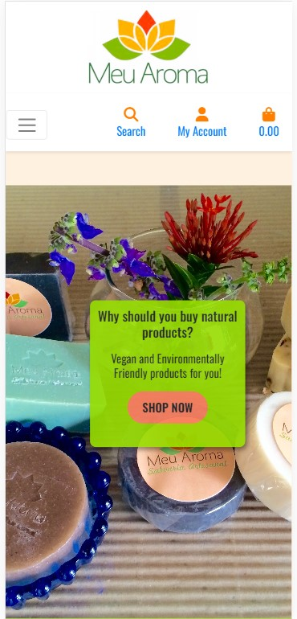
- 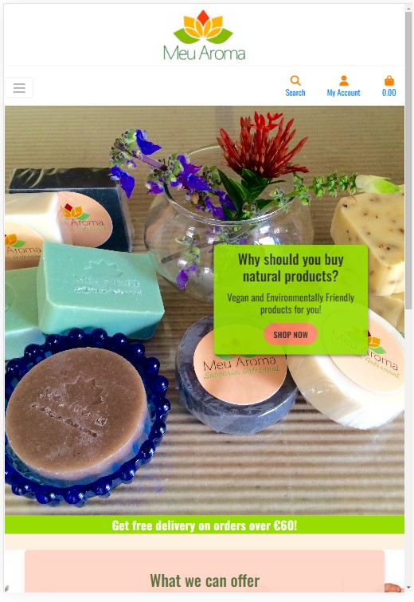
- 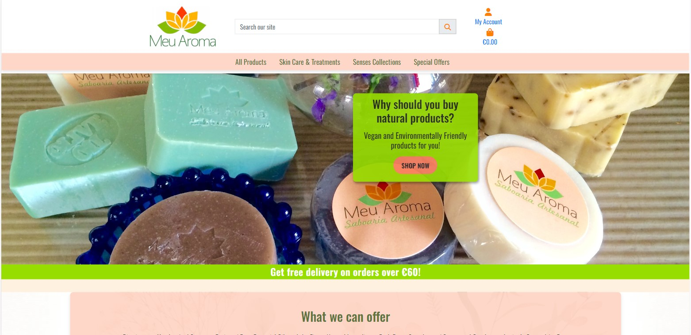

**Authentication:** Users who are not logged in can still browse and view posts. However, to actively participate by commenting or making suggestions, they must first log in. For new users without an account, the registration process is straightforward and allows them to become part of the community.

- 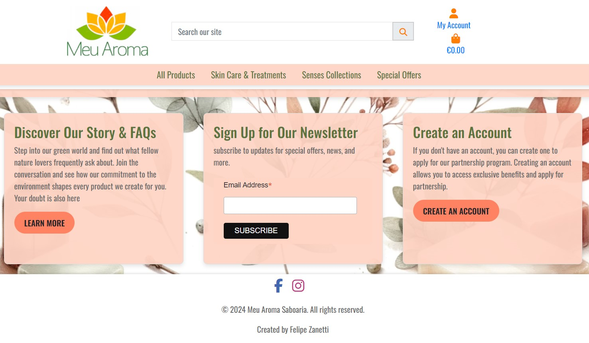

</details>


<br>


<details>
<summary>Typography Selection</summary>
<br>

In the realm of web design, typography plays a pivotal role in conveying the essence and personality of a brand. Our choice of font family for the SoapWeb page is not arbitrary but rooted in a deliberate decision-making process.

**"Oswald" Typeface:**

We have opted for the "Oswald" typeface as the cornerstone of our webpage's typography. Here's why:

**1. Modern Aesthetic:** "Oswald" offers a sleek and contemporary appearance that aligns perfectly with the modern and refined image we wish to project. Its clean lines and geometric shapes give our content a fresh and stylish look.

**2. Readability:** Ensuring that our content is easily readable is paramount. "Oswald" excels in this aspect with its clear and well-defined letterforms, making it effortless for visitors to engage with our soap-related content.

**3. Versatility:** One of the defining features of "Oswald" is its versatility. It suits a wide range of content, from headers and titles to body text, maintaining consistency and harmony throughout the webpage.

**4. Brand Cohesion:** The chosen typeface complements our brand's values and identity. It embodies qualities such as sophistication, cleanliness, and simplicity, which resonate with our soap products' purity and quality.

**5. Mobile Optimization:** "Oswald" adapts well to various screen sizes, ensuring a seamless and visually pleasing experience for mobile users, a critical consideration in today's digital landscape.

Our decision to embrace the "Oswald" font family represents a commitment to creating an appealing, user-friendly, and cohesive web environment for our soap enthusiasts. It's not just about letters on a screen; it's about crafting an immersive and memorable online experience that encapsulates the essence of our brand.

As we continue to evolve and refine our SoapWeb page, typography remains a crucial element in conveying our dedication to quality, aesthetics, and customer satisfaction.
</details>

 <br>

 <details>
<summary>Icons</summary>
Font Awesome icons have been used throughout the site, including for the buttons and social media links.
</details>

<br>

# Features

<br>

<details>
<summary>Pages and elements</summary>


<details>
<summary>Home Page</summary>

- **Description:** The home page is where you'll find the heart of our website. It features our logo, login information, a shopping bag icon, a convenient search bar, a navigation bar to select product types, quick access to frequently asked questions (FAQ), an option to subscribe to our newsletter, and an invitation to explore partnership opportunities.
- **Image:**

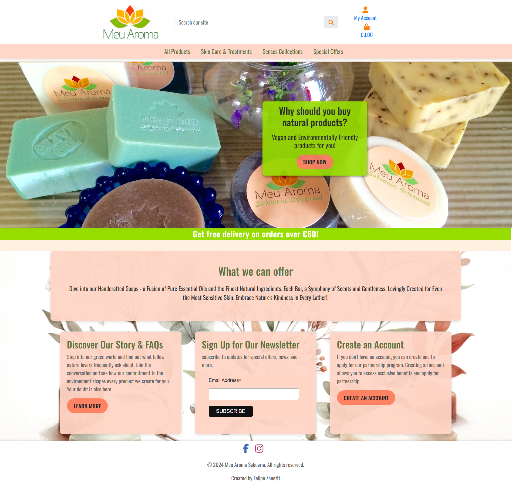

</details>

<details>
<summary>Products Page</summary>

- **Description:** The products page is a curated list showcasing a wide range of our exquisite soap products. It provides an easy way to add items to your shopping bag, displays prices, and offers brief information about each product.
- **Image:**

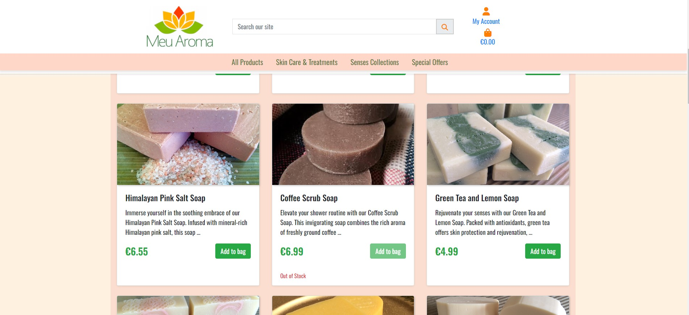

</details>


<details>
<summary>Product Details Page</summary>

- **Description:** Dive deeper into product details on this page. Here, you can explore product information, select the quantity you desire, and add products to your shopping bag.
- **Image:**

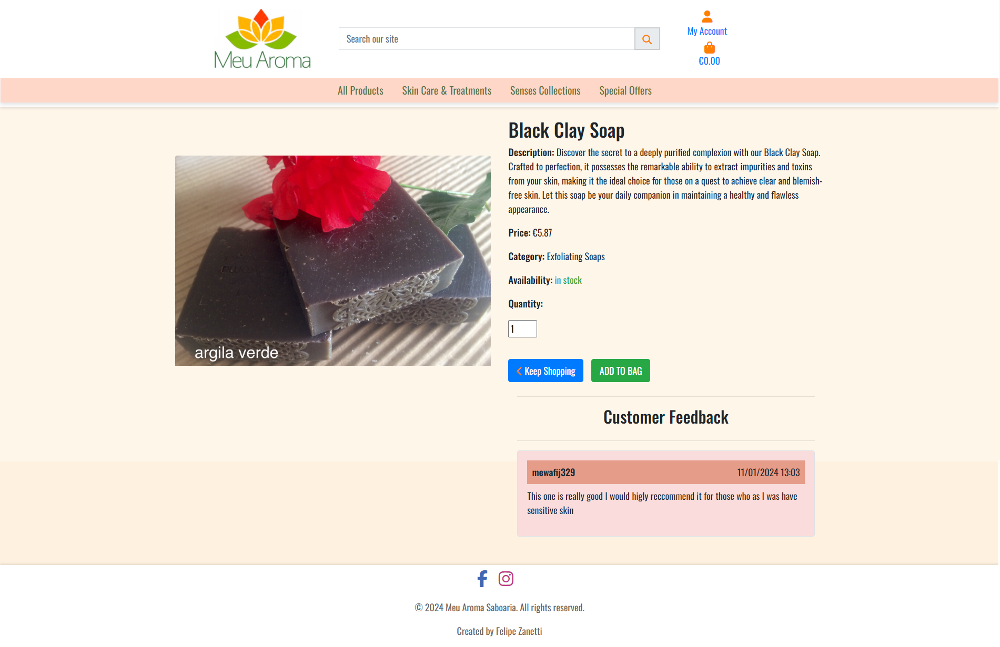

</details>

<details>
<summary>Shopping Bag</summary>

- **Description:** The shopping bag is your virtual cart where you can view and manage the items you've selected. It shows the number of soaps in your bag, provides details about each product, and offers options to remove items or update quantities. You can continue shopping or proceed to checkout from here.
- **Image:**

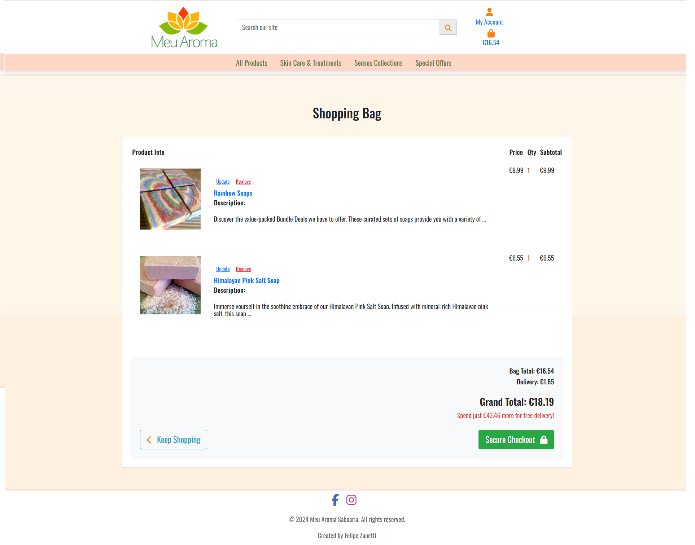

</details>

<details>

<summary>Checkout Page</summary>

- **Description:** The checkout page is where you'll finalize your purchase. It displays the total price, allows you to enter your personal details, payment card information, and provides alerts about pricing and delivery. You can also apply coupons if you have them.
- **Image:**

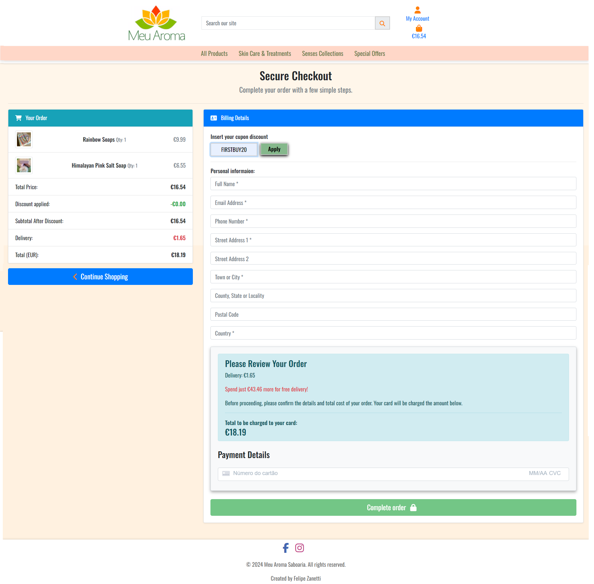

</details>

<details>
<summary>Thank You Page</summary>

- **Description:** After successfully completing your purchase, you'll be directed to the thank you page. It provides a brief summary of your order and expresses our gratitude for choosing our products.
- **Image:**

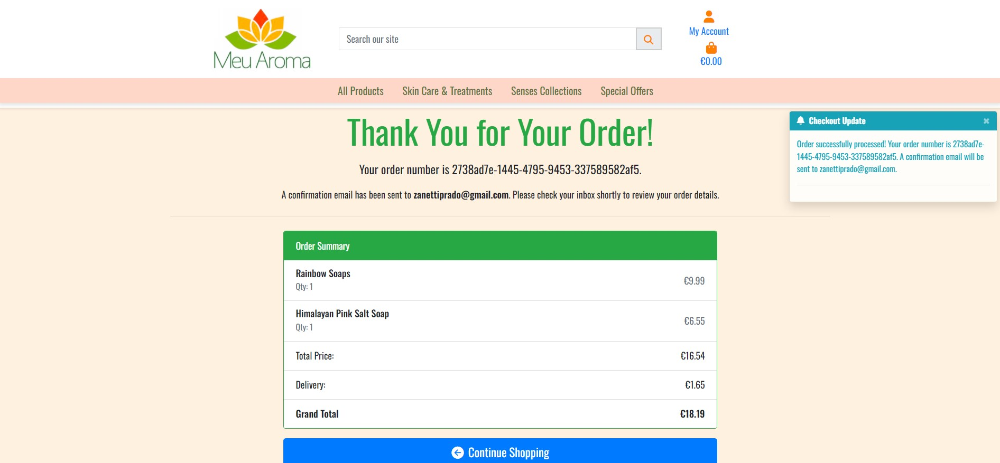

</details>

<details>
<summary>Authentication Pages</summary>

- **Description:** Easily access login, registration, and logout pages from the navigation bar. These pages ensure secure access to your account and convenient management of your shopping experience.
- **Image:**

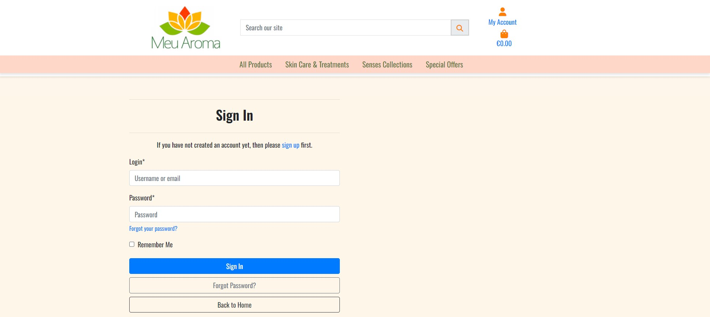
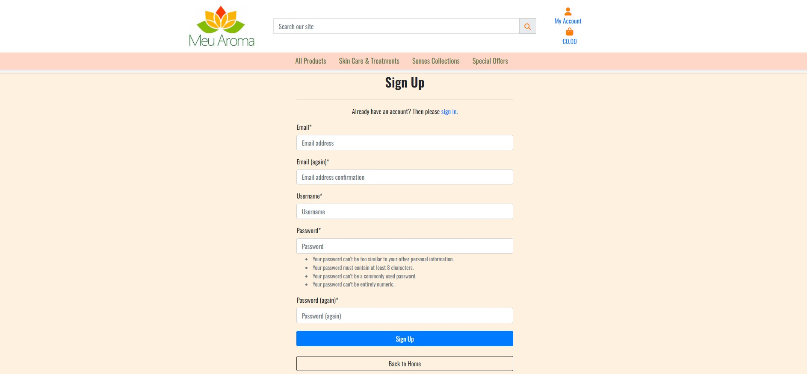
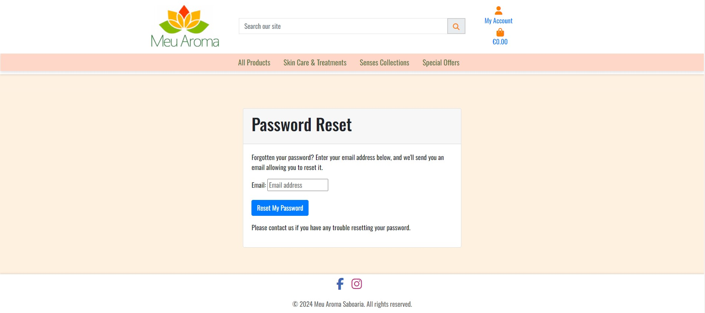

</details>

<details>
<summary>404 Error Page</summary>

- **Description:** In case you encounter a page that doesn't exist or an error occurs, our 404 error page is there to assist you in returning to the product pages seamlessly.
- **Image:**

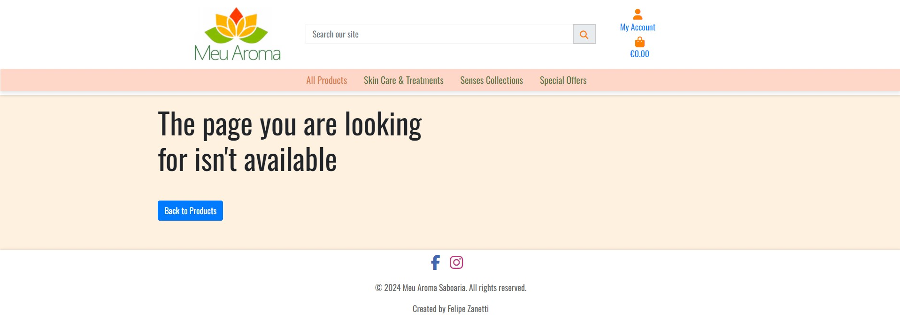

</details>
</details>

<br>
<details>
<summary>Accessibility and User-Friendly Design</summary>


At **Meu Aroma Saboaria**, accessibility is at the core of our design philosophy. We've taken extensive measures to ensure our website is not only visually appealing but also user-friendly for everyone. Here's how we've achieved this:

1. **Semantic HTML:** Our web pages are meticulously crafted using semantic HTML tags. This not only keeps our code clean and organized but also ensures that screen readers and assistive technologies can seamlessly understand and navigate the content.

2. **Descriptive Alt Attributes:** Images on our site serve more than just an aesthetic purpose; they provide valuable information. We've invested in providing detailed and meaningful alt attributes for each image. This empowers screen readers to convey content accurately to users who rely on them.

3. **Icons with Text Descriptions:** While icons can enhance user experience, they can also be confusing for some users. To make sure everyone understands their purpose, we've incorporated text descriptions alongside icons wherever necessary. This approach guarantees that all users, regardless of their abilities, can interact effectively with our site.

4. **Color Contrast:** We recognize the significance of legibility. To prioritize user experience, we've maintained a high level of color contrast throughout our site. This not only improves text and content readability but also ensures that our site is inclusive and accessible to all.

**Meu Aroma Saboaria** isn't just a website; it's a commitment to inclusivity and user-friendliness. We believe that everyone should have a seamless and enjoyable experience on our platform, irrespective of their abilities or assistive technologies.

## Features at a Glance

- **Django-Powered:** Our website is built using Django, a robust and reliable web framework. This ensures the stability and performance of our platform.

- **Vibrant Colors:** We've carefully selected a vibrant color palette to create a visually appealing and engaging user interface.

- **HTML and CSS Excellence:** Our codebase adheres to industry best practices for HTML and CSS, ensuring a smooth and efficient browsing experience.

- **SEO Optimization:** We've implemented SEO best practices to enhance the discoverability of our content and reach a wider audience.

- **Newsletter Functionality:** Stay updated with our latest offerings and news by subscribing to our newsletter, designed to keep you in the loop.

- **Ecommerce Simplicity:** Our ecommerce page is designed to be straightforward and user-friendly, catering to users of all levels of technical expertise.

At **Meu Aroma Saboaria**, we're committed to delivering an accessible, user-friendly, and visually appealing platform that serves the needs of all our valued users. Explore our website and experience the difference for yourself!


</details>

<br>

# Technologies Used in the Project


<summary>Meu Aroma technologies</summary>


<details>
<summary>Languages</summary>

- **HTML**: The foundation of our website, responsible for structuring the main site content. We have 13 HTML files in the project, ensuring a well-organized and structured user interface.
- **CSS**: Provides the styling and layout to create an attractive and user-friendly interface, ensuring a visually appealing design.
- **JavaScript**: Adds interactive elements and enhances user engagement, making the site more dynamic and responsive.
- **Python 3.8.11**: The backbone of our back-end functionality, powering the server and business logic, ensuring robust and efficient server-side operations.
</details>

<details>
<summary>Databases Used</summary>

- **ElephantSQL (Postgres Database)**: Our reliable data storage solution, offering scalability and data management capabilities, ensuring data integrity.
- **Cloudinary**: An online static file storage service used for managing media assets like images and videos, enhancing performance and media handling.
</details>

<details>
<summary>Frameworks Used</summary>

- **Django**: A high-level Python web framework that encourages rapid development and clean, pragmatic design. It streamlines development and ensures the stability and performance of our platform.
- **Bootstrap (Version 5.2.3)**: A CSS framework that accelerates front-end design, providing responsive and mobile-first layouts.
- **Allauth**: An integrated set of Django applications addressing authentication, registration, account management, and 3rd party (social) account authentication, ensuring user-friendly authentication and account management.
- **Toast**: A JavaScript library for non-blocking notifications, enhancing user interactions and providing user-friendly messages.
- **Crispy Forms**: Helps manage Django forms, providing an easy way to control their layout and rendering, ensuring visually appealing and user-friendly forms.
- **Boto & AWS**: Used for storing static files and media in the cloud, ensuring scalability and reliability in serving media assets.
</details>

<details>
<summary>Development Tools</summary>

- **Pip**: A vital tool for installing Python packages, simplifying package management and installation.
- **Jinja**: Our templating engine, facilitating dynamic content rendering and ensuring efficient rendering of dynamic content.
</details>

<details>
<summary>Version Control</summary>

- **Git**: The backbone of our version control system, enabling collaborative development and efficient code management.
- **GitHub**: Our repository for saving and managing project files, ensuring version tracking and collaboration.
</details>

<details>
<summary>Development Environment</summary>

- **Gitpod**: A cloud-based integrated development environment (IDE) for seamless development, ensuring a consistent and accessible development environment.
</details>

<details>
<summary>Hosting and Deployment</summary>

- **Heroku**: Our hosting platform for the deployed back-end site, ensuring accessibility and availability to users.
</details>

<details>
<summary>Typography and Styling</summary>

- **Google Fonts**: Imported fonts to enhance site aesthetics, ensuring visually appealing typography and design.
</details>

<details>
<summary>Testing and Debugging</summary>

- **Google Chrome Dev Tools**: Essential for troubleshooting, testing, and ensuring responsiveness and styling, guaranteeing a smooth user experience.
- **Am I Responsive?**: Used to display website images on various devices, ensuring responsiveness across different screen sizes and devices.
</details>

<details>
<summary>Additional Python Packages (requirements.txt)</summary>

- **asgiref==3.7.2**
- **boto3==1.34.14**
- **botocore==1.34.14**
- **dj-database-url==0.5.0**
- **Django==4.2.8**
- **django-allauth==0.59.0**
- **django-crispy-forms==1.14.0**
- **django-storages==1.14.2**
- **gunicorn==21.2.0**
- **jmespath==1.0.1**
- **oauthlib==3.2.2**
- **Pillow==10.1.0**
- **psycopg2==2.9.9**
- **PyJWT==2.8.0**
- **python3-openid==3.2.0**
- **requests-oauthlib==1.3.1**
- **s3transfer==0.10.0**
- **sqlparse==0.4.4**
- **stripe==7.10.0**
- **urllib3==1.26.18**


    

</details>

<br>


# Deployment & Local Development

<br>

<details>
<summary>Fork the Repository</summary>


1. Log in or Sign up: Go to GitHub and log in with your account. If you don't have an account, sign up.
2. Navigate to the Repository: Go to the repository for your project (replace your-repo-name with the actual repository name). <br>
Click here [BuzzEireBrazil](https://github.com/zanettiprado/buzzeirebrazil)
```
https://github.com/zanettiprado/buzzeirebrazil
```

3 - Fork the Repository: Click the "Fork" button in the top right corner of the repository page. This will create a copy of the repository under your GitHub account.
</details>

<br>

<details>
<summary>Clone the Repository</summary>


## 
1. Log in to GitHub: If you're not already logged in, log in to GitHub.

2. Navigate to the Repository: Go to the repository for your project.<br>
Click here [BuzzEireBrazil](https://github.com/zanettiprado/meu_aroma)
```
https://github.com/zanettiprado/meu_aroma
```
3. Clone the Repository: Click on the "Code" button on the repository page. Select your preferred method for cloning: HTTPS, SSH, or GitHub CLI. Copy the provided link.

4. Open Terminal: Open your terminal (command prompt or Git Bash on Windows, Terminal on macOS, or any terminal emulator on Linux).

5. Change Directory: Use the cd command to navigate to the location where you want to store the cloned repository.

```
cd /path/to/your/directory
```
6. Clone the Repository: In your terminal, run the following command, pasting the link you copied from step 3:
</details>

<br>

<details>
<summary>Install Project Dependencies</summary>


1. Navigate to Project Directory: Ensure you are in the project directory where the `requirements.txt` file is located.

2. Install Dependencies: In your terminal, run the following command to install the required packages:

```
pip install -r requirements.txt
```
</details>

<br>

<details>
<summary>ElephantSQL Database</summary>

In this project, we use ElephantSQL to store our data in a special database called PostgreSQL. To get your own database, follow these steps:

1. Sign up using your GitHub account.
2. Click on "Create New Instance" to make a new database.
3. Give it a name (usually the project's name, like "tribe").
4. Choose the "Tiny Turtle (Free)" plan.
5. You can ignore the "Tags" part.
6. Pick a Region and Data Center that's closest to where you are.
7. Once it's created, click on the new database's name to see the database URL and Password. You'll need these later.

</details>

<br>

<details>
<summary>Cloudinary API</summary>


We use the Cloudinary API in our project to keep our pictures and videos online because Heroku, where we host our project, doesn't save this kind of data. Here's how to get your own Cloudinary API key:

1. Create an account and log in to Cloudinary.
2. When they ask what you're interested in, pick "Programmable Media" because it's about images and videos.
3. If you want, change your cloud name to something you can remember easily.
4. On your Cloudinary Dashboard, you'll find your API Environment Variable. It looks like a long code.
5. Make sure to remove the "CLOUDINARY_URL=" part from the code because that part is your key.

</details>

<br>

<details>
<summary>Heroku Account and dployment</summary>

<br>

1. Set Up Your Heroku Account

If you don't have a Heroku account, sign up for one at https://www.heroku.com/. It's free to get started.

2. Install Heroku CLI

Download and install the Heroku Command Line Interface (CLI) for your operating system. You can find installation instructions here: https://devcenter.heroku.com/articles/heroku-cli

3. Log In to Heroku

Open your terminal or command prompt and log in to Heroku by running:
```
heroku login
```
Follow the prompts to enter your Heroku credentials.

4. Initialize a Git Repository

If your project isn't already in a Git repository, you'll need to initialize one. Navigate to your project's root directory in the terminal and run:

```
git init
git add .
git commit -m "Initial commit"
```
5. Create a requirements.txt File

If you don't already have a requirements.txt file, create one. This file lists all the Python packages required for your project. You can generate it by running:
```
pip freeze > requirements.txt
```
6. Create a Procfile

Create a file named Procfile (without any file extension) in your project's root directory. This file tells Heroku how to run your application. Inside the Procfile, add:

```
web: python your_app_name/manage.py runserver 0.0.0.0:$PORT
```
7. Install Gunicorn

Gunicorn is a WSGI HTTP server for Python applications. Install it by running:
```
pip install gunicorn
```

8. Add Heroku Buildpacks
Heroku uses buildpacks to determine how to build and run your application. You'll need to add Python and Node.js buildpacks if your project uses JavaScript or CSS. Run the following commands to add buildpacks:
```
heroku buildpacks:add heroku/python
```
9. Set Environment Variables

Set the environment variables in Heroku that you mentioned earlier. You can do this by running:
```
heroku config:set CLOUDINARY_URL=your_cloudinary_api_key
heroku config:set DATABASE_URL=your_database_url
heroku config:set DISABLE_COLLECTSTATIC=1
heroku config:set SECRET_KEY=your_secret_key 
```

Replace your_cloudinary_api_key, your_database_url, and your_secret_key with your actual keys and URLs.

10. Deploy to Heroku

Now it's time to deploy your project to Heroku. Run:
``` 
git push heroku master
```

This command will push your code to Heroku's servers and trigger the deployment process.

11. Run Migrations

After deploying, run the following command to apply database migrations:
``` 
heroku run python manage.py migrate 
```

12. Open Your App

Your app should be deployed and live on Heroku now! You can open it in your browser using
``` 
heroku open
```

</details>

<br>

<details>

<br>

<summary>AWS S3 Bucket for Static Files</summary>

In this project, we use Amazon S3 to store static files like images and media. Here's how to set up your AWS S3 bucket:

1. **Sign in to the AWS Management Console**.

2. **Open the Amazon S3 console**.

3. **Create a new S3 bucket**: Click the "Create bucket" button, and follow the prompts to configure your bucket. Make sure to choose a unique name and configure your bucket's permissions.

4. **Note the bucket name**: You'll need this name later to configure your project.

5. **Set up IAM (Identity and Access Management)**: Create a new IAM user with programmatic access and attach a policy that grants access to your S3 bucket. Make sure to save the access key and secret access key.

6. **Configure your project**: In your project settings, update the configuration to use your S3 bucket for static and media files. You'll need to provide your AWS access key, secret key, and the bucket name.

</details>

<br>
